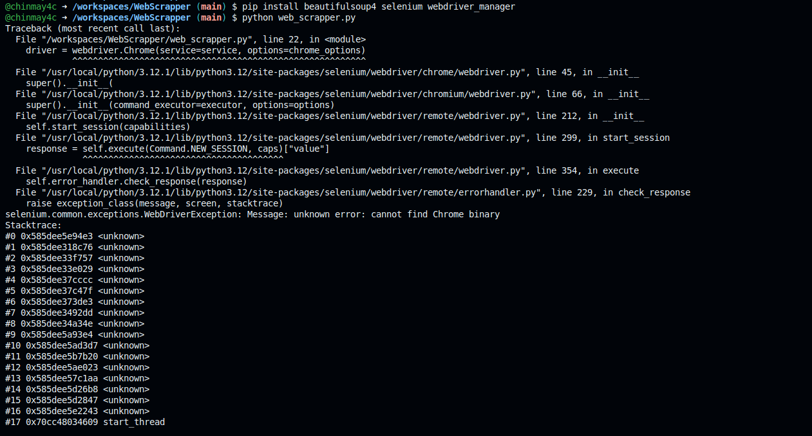

Here’s the updated `README.md` with direct installation instructions instead of using a `requirements.txt` file:

---

# Web Scraper Project

This project scrapes product data from Amazon, Flipkart, and Myntra based on a search query. The data is then saved into CSV files for further analysis.

## Prerequisites

Before you begin, ensure you have the following installed on your system:

- **Python 3.x**: Make sure Python is installed and added to your system's PATH.
- **pip**: Python package installer.

## Setup Instructions

### Step 1: Clone the Repository

Clone this repository to your local machine using the following command:

```bash
git clone https://github.com/chinmay4c/WebScrapper.git
```

### Step 2: Navigate to the Project Directory

```bash
cd WebScrapper
```

### Step 3: Create a Virtual Environment (Optional but Recommended)

It is recommended to create a virtual environment to manage your project dependencies:

```bash
python -m venv venv
```

Activate the virtual environment:

- **Windows**:
  ```bash
  venv\Scripts\activate
  ```
- **macOS/Linux**:
  ```bash
  source venv/bin/activate
  ```

### Step 4: Install Required Packages

Install the necessary Python packages using `pip`:

```bash
pip install beautifulsoup4 selenium webdriver_manager
```

### Step 5: Download ChromeDriver

The script uses Selenium to control a Chrome browser. WebDriverManager is used to automatically manage ChromeDriver, so there’s no need to manually download it.

### Step 6: Set Up Chrome Options

The script is configured to run Chrome in headless mode (no browser window is shown). If you want to see the browser window, set `chrome_options.headless = False` in the script.

## Running the Script

### Step 1: Modify the Query

In the script, the search queries for Amazon, Flipkart, and Myntra are hardcoded as `'laptop'` and `'t-shirt'`. You can change these queries to suit your needs.

### Step 2: Run the Script

Run the script using Python:

```bash
python web_scrapper.py
```

### Step 3: Check the Output

The script will save the scraped data into CSV files named `amazon_products.csv`, `flipkart_products.csv`, and `myntra_products.csv` in the same directory as the script.

You can verify the content of these files by running the script, which will display the contents of the CSV files in the console.




## Troubleshooting

### Common Issues

- **TimeoutException**: If the page elements are not loaded within the specified time, you may need to increase the wait time in the `WebDriverWait` function.
- **Headless Mode Issues**: If you encounter issues in headless mode, try disabling it by setting `chrome_options.headless = False`.

### Logs and Debugging

If the script fails or does not work as expected, check the console output for error messages. The page source is printed when a timeout occurs, which can help debug the issue.

## Contributing

If you'd like to contribute to this project, please fork the repository and use a feature branch. Pull requests are warmly welcome.

## License

This project is licensed under the MIT License - see the [LICENSE](LICENSE) file for details.

---
